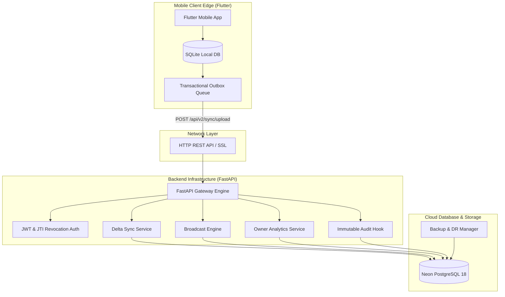
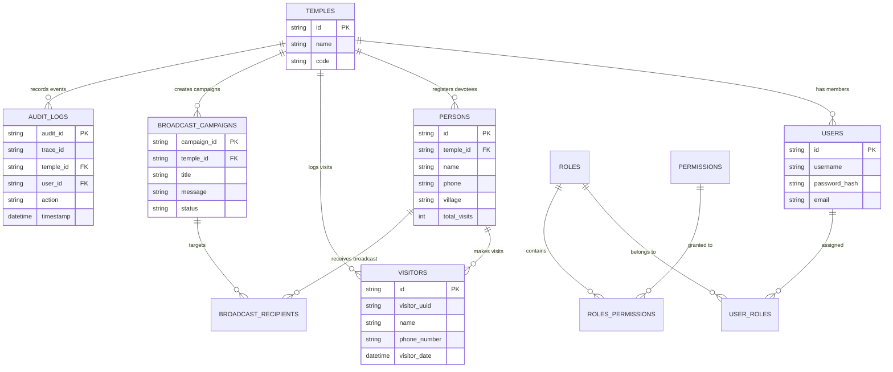
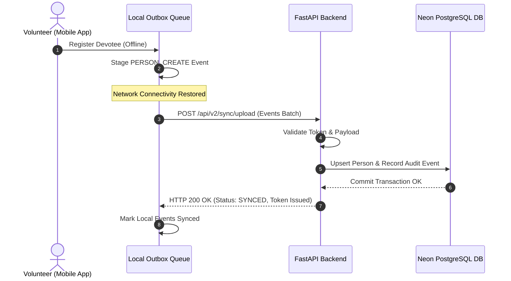
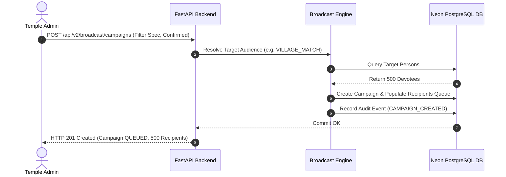
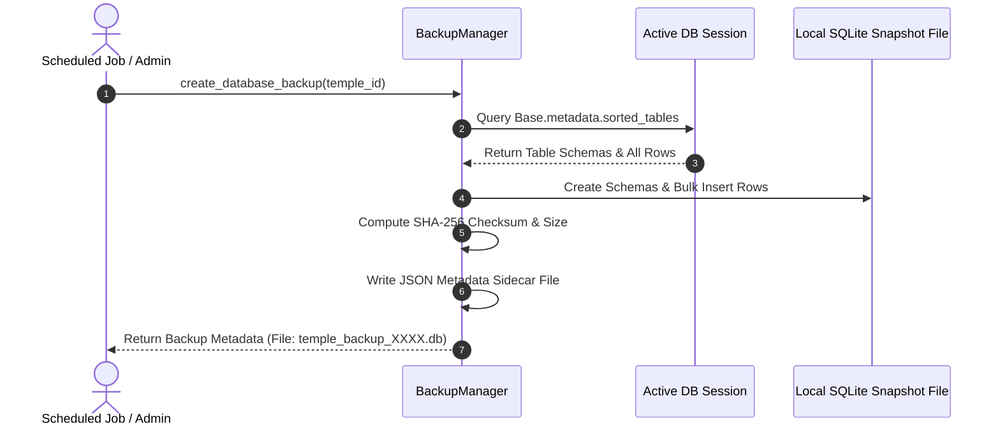

# Software Architecture Document (SAD) - v2.0
## Temple Visitor Management System Enterprise Edition

### 1. Architectural Goals & Constraints
- **Offline First**: Continuous operation on edge mobile devices using SQLite.
- **Data Integrity**: Eventual consistency via Transactional Outbox pattern.
- **Serverless Cloud Scale**: Live Neon PostgreSQL 18 database with SSL connection pooling.
- **Multi-Tenant Isolation**: Tenant boundary enforcement via `X-Temple-ID` context.
- **Audit Compliance**: Immutable, append-only administrative logging.

---

### 2. System Architecture Diagram

---

### 3. Database ER Diagram (29 Core Entities Snapshot)

---

### 4. Sequence Diagrams

#### 4.1 Delta Synchronization Sequence

#### 4.2 Broadcast Campaign Sequence

#### 4.3 Backup & Disaster Recovery Sequence

